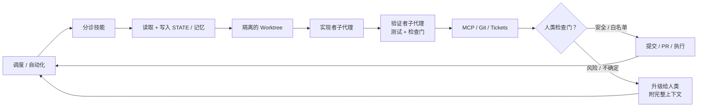

# Loop Engineering（循环工程）

> **声明：** 本文档是对 [cobusgreyling/loop-engineering](https://github.com/cobusgreyling/loop-engineering) 官方仓库 README.md 的**中文翻译与介绍**。项目原作者为 [Cobus Greyling](https://github.com/cobusgreyling)，灵感源自 [Addy Osmani](https://addyosmani.com/blog/loop-engineering/) 与 [Boris Cherny](https://x.com/bcherny)（Anthropic Claude Code 负责人）。本翻译仅供参考，所有内容以[英文原文](https://github.com/cobusgreyling/loop-engineering)为准。翻译者与上游项目无关联。


<p align="center">
  <a href="https://cobusgreyling.github.io/loop-engineering/">
    
  </a>
</p>

<p align="center">
  <a href="https://github.com/cobusgreyling/loop-engineering/stargazers"></a>
  <a href="https://github.com/cobusgreyling/loop-engineering/actions/workflows/audit.yml"></a>
  <a href="https://www.npmjs.com/package/@cobusgreyling/loop-audit"></a>
  <a href="https://www.npmjs.com/package/@cobusgreyling/loop-init"></a>
  <a href="https://www.npmjs.com/package/@cobusgreyling/loop-cost"></a>
  <a href="https://github.com/cobusgreyling/loop-engineering/blob/main/LICENSE"></a>
  <a href="https://cobusgreyling.github.io/loop-engineering/"></a>
</p>


<p align="center">
  
</p>

**循环工程的含义：你不再是那个亲手给 AI 代理写提示词的人，而是设计一套能自动完成这件事的系统。**

面向使用 Grok、Claude Code、Codex、Cursor 及其他 AI 编码代理的开发者。

一个**循环**就是一个递归目标：你定义一个目的，AI 不断迭代（通常借助子代理、验证器和外部状态），直到目标完成，或者循环自行判断该把控制权交还给人类。


<p align="center">
  
</p>

<p align="center">
  <strong><a href="https://cobusgreyling.github.io/loop-engineering/">→ 交互式展示 + 模式选择器</a></strong>
  <br>
  <strong><a href="https://cobusgreyling.substack.com/p/loop-engineering">→ Loop Engineering 论文 (Substack)</a></strong>
  <br>
  <a href="https://addyosmani.com/blog/loop-engineering/">Addy Osmani 的经典论文</a>
</p>

## 目录

- [快速链接](#快速链接)
- [为什么重要](#为什么重要)
- [五大基础构件 + 记忆](#五大基础构件--记忆)
- [模式](#模式)
- [5 分钟快速上手](#5-分钟快速上手)
- [按工具的示例](#按工具的示例)
- [运维与安全](#运维与安全)
- [注意事项](#注意事项)
- [贡献](#贡献)
- [来源](#来源)
- [许可证](#许可证)

## 快速链接

| 从哪里开始 | 说明 |
|------------|-------------|
| [Loop Engineering 论文](https://cobusgreyling.substack.com/p/loop-engineering) | 概念、基础原语与 Grok 映射 —— **请先读这篇** |
| [模式选择器](docs/pattern-picker.md) | 应该先跑哪个循环 —— **不确定选什么就从这里开始** |
| [原语对照矩阵](docs/primitives-matrix.md) | Grok vs Claude Code vs Codex —— 建议收藏 |
| [循环设计检查清单](docs/loop-design-checklist.md) | 上线就绪评分表 |
| [模式](patterns/README.md) | 7 个生产模式 + [交互式选择器](https://cobusgreyling.github.io/loop-engineering/#interactive) |
| [启动模板](starters/) | 开箱即用的模板套件（Grok, Claude Code, Codex） |
| [loop-audit](tools/loop-audit/) | 循环就绪评分 CLI（v1.4 + 活跃度检测）—— `npx @cobusgreyling/loop-audit . --suggest` |
| [loop-init](tools/loop-init/) | 脚手架工具 + 预算/运行日志（v1.2）—— `npx @cobusgreyling/loop-init . --pattern daily-triage --tool grok` |
| [loop-cost](tools/loop-cost/) | Token 花费估算器 —— `npx @cobusgreyling/loop-cost` |
| [故事](stories/) | 真实的成功与诚实的失败 |

## 为什么重要

Peter Steinberger：
> "你不应该再亲手给编码代理发提示词了。你应该设计能给代理发指令的循环。"

Boris Cherny（Anthropic Claude Code 负责人）：
> "我已经不再给 Claude 写提示词了。我让运行中的循环来提示 Claude 并决定要做什么。我的工作变成了写循环。"

杠杆点已经从精心编写单个提示词，转移到了设计能够长期编排代理的控制系统。

## 五大基础构件 + 记忆

| 基础原语 | 在循环中的职责 |
|-----------|-----------------|
| **自动化 / 调度** | 按节奏发现和分诊 |
| **Worktrees** | 安全的并行执行 |
| **Skills（技能）** | 持久化的项目知识 |
| **插件与连接器** | 接入你的真实工具（MCP） |
| **子代理** | Maker / Checker 分离 |
| **+ 记忆 / 状态** | 独立于任何对话之外的持久化中枢 |

详细说明：[docs/primitives.md](docs/primitives.md) · 跨工具矩阵：[docs/primitives-matrix.md](docs/primitives-matrix.md)

### 可视化概览

<p align="center">
  
</p>

### 循环结构示意（Mermaid）



**这个参考仓库本身也在每次 push/PR 时运行 `validate-patterns` + `audit` 工作流**（见 `.github/workflows/`）。同时我们还添加了 `LOOP.md` 来描述将来维护该仓库的循环。

## 模式

| 模式 | 频率 | 启动模板 | 第一周 | Token 成本 |
|---------|---------|---------|--------|------------|
| [每日分诊](patterns/daily-triage.md) | 1天–2小时 | [minimal-loop](starters/minimal-loop/) | **L1** 报告 | 低 |
| [PR 保姆](patterns/pr-babysitter.md) | 5–15分钟 | [pr-babysitter](starters/pr-babysitter/) | L1 观察 | 高 |
| [CI 清扫者](patterns/ci-sweeper.md) | 5–15分钟 | [ci-sweeper](starters/ci-sweeper/) | L2 谨慎 | 非常高 |
| [依赖清扫者](patterns/dependency-sweeper.md) | 6小时–1天 | [dependency-sweeper](starters/dependency-sweeper/) | L2 仅补丁 | 中 |
| [更新日志起草者](patterns/changelog-drafter.md) | 1天或打标签时 | [changelog-drafter](starters/changelog-drafter/) | **L1** 草稿 | 低 |
| [合并后清理](patterns/post-merge-cleanup.md) | 1天–6小时 | [post-merge-cleanup](starters/post-merge-cleanup/) | **L1** 非高峰 | 低 |
| [Issue 分诊](patterns/issue-triage.md) | 2小时–1天 | [minimal-loop](starters/minimal-loop/) | **L1** 仅提议 | 低 |

不确定选哪个？试试[交互式选择器](https://cobusgreyling.github.io/loop-engineering/#interactive)或[模式选择器](docs/pattern-picker.md)。

机器可读索引：[patterns/registry.yaml](patterns/registry.yaml)（7 个模式）

## 5 分钟快速上手

```bash
# 1. 用脚手架创建一个启动模板（也可手动复制 —— 见 starters/）
npx @cobusgreyling/loop-init . --pattern daily-triage --tool grok

# 2. 估算你的节奏下的 Token 花费
npx @cobusgreyling/loop-cost --pattern daily-triage --level L1

# 3. 审计就绪程度（现在包含预算 + 运行日志的评分）
npx @cobusgreyling/loop-audit . --suggest

# 4. 观察评分攀升：空 → L1 → L2
bash scripts/before-after-demo.sh

# 5. 以仅报告模式启动（Grok 示例）
/loop 1d 运行 loop-triage。更新 STATE.md。第一周不做自动修复。
```

全部三个 CLI 工具都从带标签的 release 发布到 npm —— 见 [docs/RELEASE.md](docs/RELEASE.md)。无需 clone 即可使用。

**从源码开发**（monorepo 贡献者）：

```bash
cd tools/loop-init && npm ci && npm test && node dist/cli.js /path/to/project --pattern daily-triage --tool grok
cd tools/loop-audit && npm ci && npm test && node dist/cli.js /path/to/project --suggest
cd tools/loop-cost && npm ci && npm test && node dist/cli.js --pattern ci-sweeper --cadence 15m
```

分阶段上线：**L1 报告 → L2 辅助修复 → L3 无人值守** —— 见 [loop-design-checklist](docs/loop-design-checklist.md)。

## 按工具的示例

- [Grok](examples/grok/daily-triage.md)
- [Claude Code](examples/claude-code/)
- [Codex](examples/codex/)
- [GitHub Actions](examples/github-actions/)

## 运维与安全

- [故障模式](docs/failure-modes.md) —— 事故式目录
- [反模式](docs/anti-patterns.md) —— 上线前应避免的设计错误
- [多循环协调](docs/multi-loop.md) —— 当多个循环发生冲突时
- [运维循环](docs/operating-loops.md) —— 成本、日志、何时终止
- [安全](docs/safety.md) —— denylist、自动合并、MCP 作用域
- [安全策略](SECURITY.md) —— 报告方式与无人值守自动化的风险
- [概念](docs/concepts.md) —— 意图债务、理解债务、Harness vs Loop
- [MCP 实践手册](examples/mcp/) —— 按模式分类的连接器示例

## 注意事项

循环工程会放大你的判断力 —— 好的和坏的都一样放大。

- **Token 成本** 可能在子代理和长期运行的循环中急剧膨胀。
- **验证的责任仍然在你身上。** 无人值守的循环会犯无人值守的错误。
- **理解债务** 会比你快很多地增长，除非你阅读循环产出的内容。
- 两个人运行同一个循环可能得到截然相反的结果。循环不知道，但你知道。

Addy Osmani：
> "去构建循环。但要像一个打算继续做工程师的人那样去构建，而不是像一个只按'开始'按钮的人。"

## 贡献

分享你的生产模式、工具映射和失败故事。参见 [CONTRIBUTING.md](CONTRIBUTING.md)、[采用者列表](docs/adopters.md) 以及 [GitHub Discussions](https://github.com/cobusgreyling/loop-engineering/discussions)。

## 来源

- [Cobus Greyling – Loop Engineering (Substack)](https://cobusgreyling.substack.com/p/loop-engineering)
- [Addy Osmani – Loop Engineering](https://addyosmani.com/blog/loop-engineering/)
- [致谢与延伸阅读](resources/sources.md)

## 许可证

MIT

---

*面向循环工程的实用、工具感知型参考手册 —— 可直接克隆的模式、可用于上线的检查清单，以及包含"哪里坏了"的真实故事。*

<p align="center">
  <a href="https://cobusgreyling.substack.com/p/loop-engineering">论文</a>
  ·
  <a href="https://cobusgreyling.github.io/loop-engineering/">展示</a>
  ·
  <a href="https://github.com/cobusgreyling">Cobus Greyling</a>
</p>
